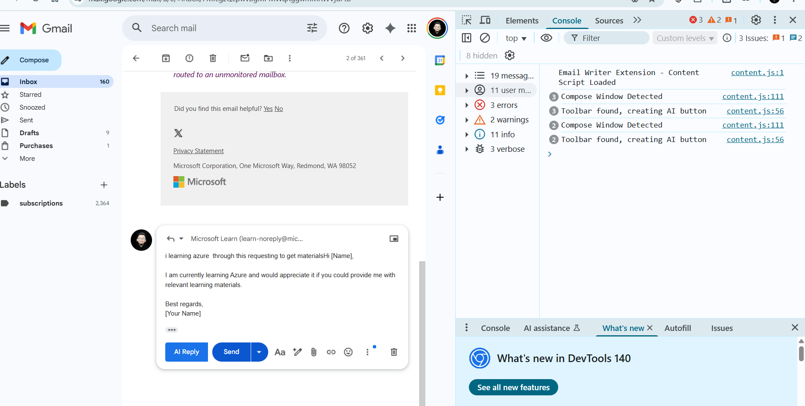
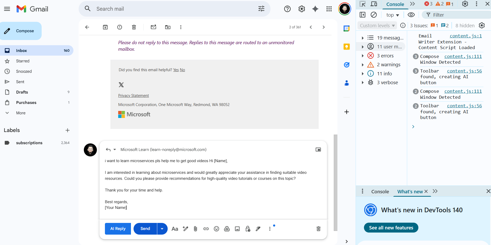
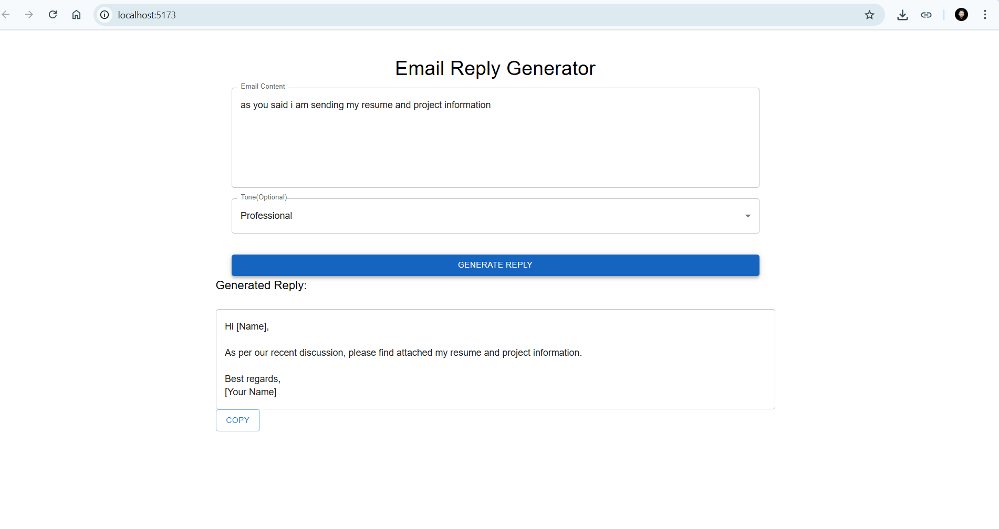

# 📧 Email Writer Assistant

An intelligent Email Writing Assistant powered by **Google Gemini**, **Spring Boot**, and **Spring AI**, with a seamless **Chrome Extension** integration. This tool helps users quickly generate professional and context-aware email content directly within their email compose window.

---

##  Features

-  AI-powered email generation using **Google Gemini API**
-  Backend built with **Spring Boot** and **Spring AI**
- Generates email replies or new emails based on prompt or context
-  **Chrome Extension** with toolbar button for easy integration with Gmail (or other webmail)
-  Secure and fast API communication

---

##  Tech Stack

- **Backend**: Spring Boot, Spring AI, Google Gemini API
- **Frontend (Extension)**: HTML, JavaScript, Chrome Extension APIs
- **AI Model**: Google Gemini (via Spring AI integration)

---
##  How It Works

### 1. Chrome Extension
- Adds a **" AI reply"** button in the email compose toolbar (e.g., in Gmail).
- On button click, captures the current email context or prompt from user input.
- Sends this to the Spring Boot backend API.

### 2. Spring Boot + Spring AI Backend
- Receives the request from the extension.
- Sends the prompt/context to **Google Gemini** via Spring AI.
- Returns a well-crafted email response.

### 3. Chrome Extension
- Receives the response from backend.
- Automatically inserts the generated email content into the email compose area.

---

## Demo

---

---

---

---

